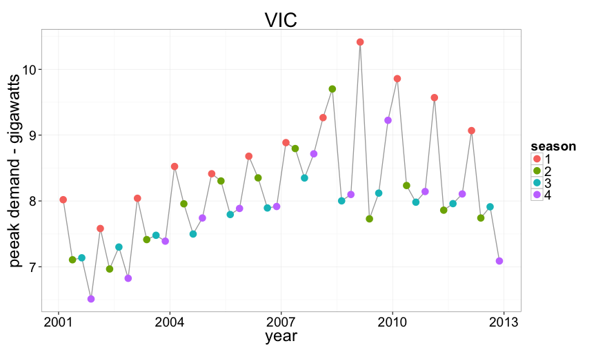
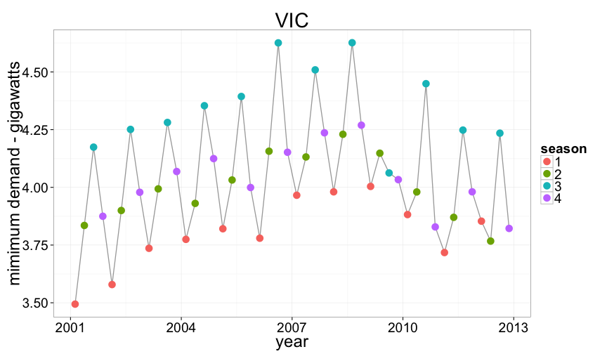
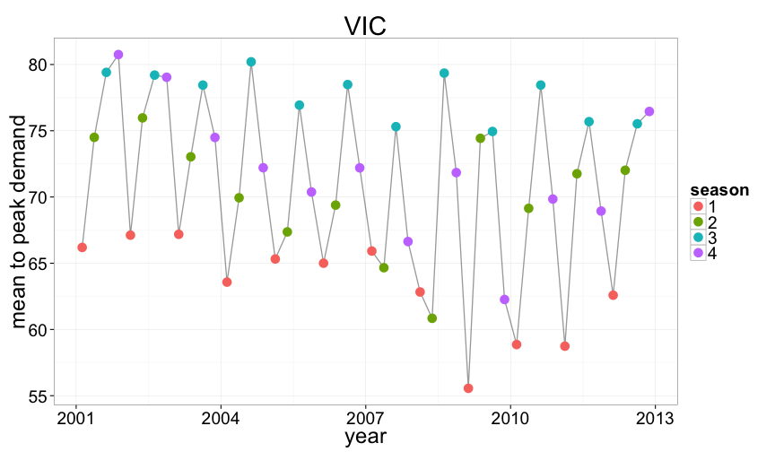
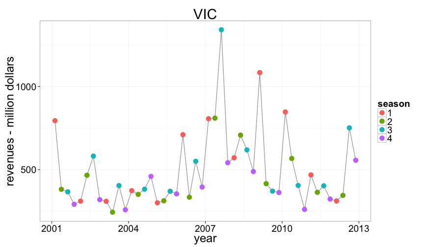
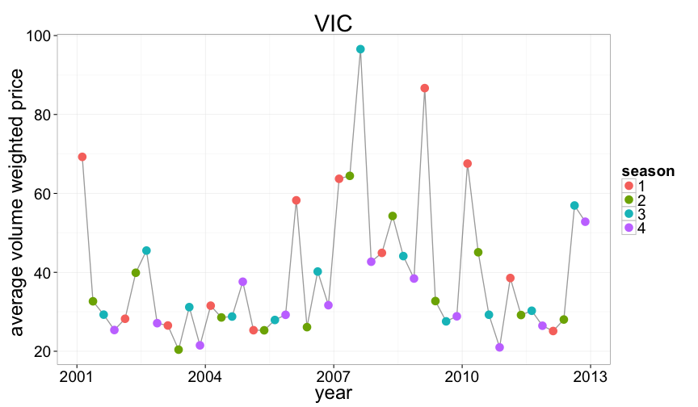
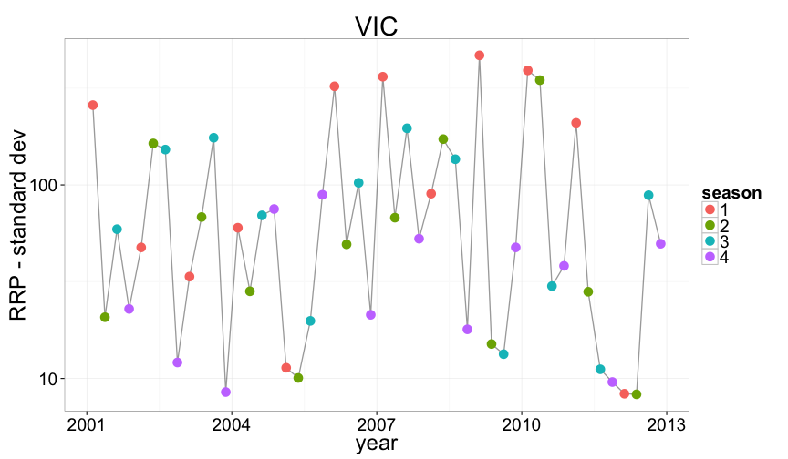

## Making it work

load data using R package 'aemo'


```r
require(plyr, ggplot2, aemo)
state = "VIC"
plots <- NEM_quarterly_trends(state = state)
```


---
## `VIC` mean demand
 

---
## `VIC` peak demand
 

---
## `VIC` min demand
 

---
## `VIC` mean to peak demand
 

---

## `VIC` revenue
 

---

## `VIC` volume weighted price
 


---

## `VIC` standard deviation
 

